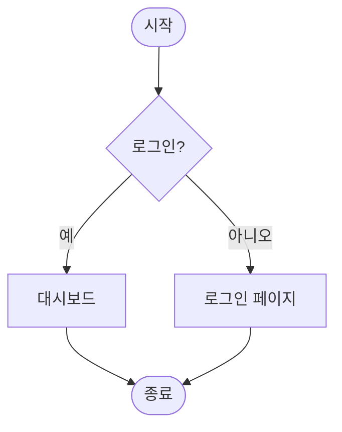

# README.md파일 작성
## ai를 활용한 백엔드 개발
## 부제목
**중요해** <br>


<hr>

---




```markdown
# SimpleCalculator - Java Swing GUI 계산기

**Enhanced Calculator**는 Java Swing을 이용해 만든 간단하지만 시각적으로 예쁜 사칙연산 계산기입니다.

## 📌 프로젝트 소개

이 프로젝트는 초보자도 쉽게 이해할 수 있도록 **Java Swing**으로 구현된 데스크톱 계산기입니다.  
두 개의 숫자를 입력받아 **더하기, 빼기, 곱하기, 나누기** 연산을 수행하고, 결과를 다이얼로그로 보여줍니다.

### 주요 특징
- **예쁜 UI 디자인**: 색상 테마 적용 (라벤더, 라이트그린 등)
- **버튼별 색상 구분**: 연산자별로 다른 색상으로 시각적 구분
- **입력 유효성 검사**: 숫자가 아닌 값 입력 시 에러 처리
- **0으로 나누기 방지**: 에러 메시지 출력
- **결과 포맷팅**: 정수는 정수로, 실수는 소수점 2자리까지 표시
- **반응형 레이아웃**: `BorderLayout`, `GridLayout` 활용

---

## 📁 프로젝트 구조

```
SimpleCalculator Project
├── src/
│   └── test/
│       └── SimpleCalculator.java     # 메인 클래스 (모든 코드 포함)
├── README.md
└── (선택) SimpleCalculator.class     # 컴파일 후 생성
```

**단일 파일 프로젝트**로 구성되어 있어 별도의 패키지나 의존성 없이 바로 실행 가능합니다.

---

## 🚀 실행 방법

### 1. 컴파일 및 실행 (터미널 / 명령 프롬프트)

```bash
# 1. 컴파일
javac -d . src/test/SimpleCalculator.java

# 2. 실행
java test.SimpleCalculator
```

### 2. IDE 사용 시 (추천)
- IntelliJ IDEA, Eclipse, VS Code 등에서 `SimpleCalculator.java` 파일을 열고 Run
- Java 8 이상 권장

---

## 📋 전체 소스 코드

```java
package test;

import javax.swing.*;
import java.awt.*;
import java.awt.event.ActionEvent;
import java.awt.event.ActionListener;

public class SimpleCalculator extends JFrame implements ActionListener {

    private JTextField num1Field;
    private JTextField num2Field;
    private JButton addBtn;
    private JButton subBtn;
    private JButton mulBtn;
    private JButton divBtn;

    public SimpleCalculator() {
        // Frame setup
        setTitle("Enhanced Calculator");
        setSize(400, 300);
        setDefaultCloseOperation(JFrame.EXIT_ON_CLOSE);
        setLocationRelativeTo(null); // Center the window
        getContentPane().setBackground(new Color(230, 230, 250)); // Lavender background

        // Main Panel
        JPanel panel = new JPanel();
        panel.setLayout(new BorderLayout(10, 10));
        panel.setBackground(new Color(240, 250, 240));
        panel.setBorder(BorderFactory.createTitledBorder(
            BorderFactory.createEtchedBorder(), 
            "Calculator Operations", 
            javax.swing.border.TitledBorder.CENTER, 
            javax.swing.border.TitledBorder.TOP, 
            null, Color.DARK_GRAY));
        
        // Input Panel
        JPanel inputPanel = new JPanel(new GridLayout(2, 2, 10, 10));
        inputPanel.setBackground(panel.getBackground());

        JLabel num1Label = new JLabel("Number 1:");
        num1Label.setHorizontalAlignment(SwingConstants.RIGHT);
        num1Label.setForeground(new Color(70, 130, 180));
        num1Field = new JTextField();
        num1Field.setBorder(BorderFactory.createLineBorder(new Color(100, 149, 237)));

        JLabel num2Label = new JLabel("Number 2:");
        num2Label.setHorizontalAlignment(SwingConstants.RIGHT);
        num2Label.setForeground(new Color(70, 130, 180));
        num2Field = new JTextField();
        num2Field.setBorder(BorderFactory.createLineBorder(new Color(100, 149, 237)));

        inputPanel.add(num1Label);
        inputPanel.add(num1Field);
        inputPanel.add(num2Label);
        inputPanel.add(num2Field);

        // Button Panel
        JPanel buttonPanel = new JPanel(new GridLayout(2, 2, 5, 5));
        buttonPanel.setBackground(panel.getBackground());

        addBtn = new JButton("+");
        subBtn = new JButton("-");
        mulBtn = new JButton("*");
        divBtn = new JButton("/");

        customizeButton(addBtn, new Color(144, 238, 144), new Color(0, 100, 0));
        customizeButton(subBtn, new Color(255, 182, 193), new Color(139, 0, 0));
        customizeButton(mulBtn, new Color(173, 216, 230), new Color(0, 0, 139));
        customizeButton(divBtn, new Color(255, 255, 153), Color.ORANGE);

        buttonPanel.add(addBtn);
        buttonPanel.add(subBtn);
        buttonPanel.add(mulBtn);
        buttonPanel.add(divBtn);

        panel.add(inputPanel, BorderLayout.NORTH);
        panel.add(buttonPanel, BorderLayout.CENTER);

        add(panel, BorderLayout.CENTER);

        // 이벤트 리스너 등록
        addBtn.addActionListener(this);
        subBtn.addActionListener(this);
        mulBtn.addActionListener(this);
        divBtn.addActionListener(this);
    }

    private void customizeButton(JButton button, Color bgColor, Color fgColor) {
        button.setBackground(bgColor);
        button.setForeground(fgColor);
        button.setFont(new Font("Arial", Font.BOLD, 16));
        button.setBorder(BorderFactory.createLineBorder(fgColor.darker(), 1));
    }

    private String formatResult(double result) {
        if (result == (long) result) {
            return String.format("%d", (long) result);
        } else {
            return String.format("%.2f", result);
        }
    }

    @Override
    public void actionPerformed(ActionEvent e) {
        try {
            double num1 = Double.parseDouble(num1Field.getText().trim());
            double num2 = Double.parseDouble(num2Field.getText().trim());
            double result = 0;
            String message = "";

            if (e.getSource() == addBtn) {
                result = num1 + num2;
                message = String.format("Result: %.2f + %.2f = %s", num1, num2, formatResult(result));
            } else if (e.getSource() == subBtn) {
                result = num1 - num2;
                message = String.format("Result: %.2f - %.2f = %s", num1, num2, formatResult(result));
            } else if (e.getSource() == mulBtn) {
                result = num1 * num2;
                message = String.format("Result: %.2f * %.2f = %s", num1, num2, formatResult(result));
            } else if (e.getSource() == divBtn) {
                if (num2 == 0) {
                    JOptionPane.showMessageDialog(this, "Error: Division by zero", 
                        "Calculation Error", JOptionPane.ERROR_MESSAGE);
                    return;
                }
                result = num1 / num2;
                message = String.format("Result: %.2f / %.2f = %s", num1, num2, formatResult(result));
            }
            
            JOptionPane.showMessageDialog(this, message, "Calculation Result", JOptionPane.INFORMATION_MESSAGE);

        } catch (NumberFormatException ex) {
            JOptionPane.showMessageDialog(this, "Error: Invalid input. Please enter valid numbers.", 
                "Input Error", JOptionPane.ERROR_MESSAGE);
        } catch (Exception ex) {
            JOptionPane.showMessageDialog(this, "An unexpected error occurred.", 
                "Error", JOptionPane.ERROR_MESSAGE);
        }
    }

    public static void main(String[] args) {
        SwingUtilities.invokeLater(() -> {
            new SimpleCalculator().setVisible(true);
        });
    }
}
```

---

## 📚 사용된 개념 상세 설명

### 1. Java Swing GUI 프로그래밍
- `JFrame`: 최상위 컨테이너 (창)
- `JPanel`: 컴포넌트를 그룹화하는 패널
- `JTextField`, `JLabel`, `JButton`: 입력 및 출력 컴포넌트

### 2. 레이아웃 매니저 (Layout Manager)
- `BorderLayout`: NORTH / CENTER 배치
- `GridLayout`: 격자 형태 배치 (입력 필드 2×2, 버튼 2×2)

### 3. 이벤트 처리 (Event Handling)
- `ActionListener` 인터페이스 구현
- `actionPerformed(ActionEvent e)` 메서드
- `e.getSource()`로 어떤 버튼이 클릭되었는지 판단

### 4. 예외 처리
- `NumberFormatException`: 숫자 변환 실패
- `ArithmeticException` 방지 (0으로 나누기)

### 5. UI 커스터마이징
- `Color` 클래스 사용
- `Font`, `BorderFactory`, `Border`
- `JOptionPane`으로 결과 및 에러 표시

---

## 📖 참고 자료 및 학습 링크

- **Oracle Java Swing Tutorial** (공식)  
  [https://docs.oracle.com/javase/tutorial/uiswing/](https://docs.oracle.com/javase/tutorial/uiswing/)

- **Java GUI Programming (Swing)** - GeeksforGeeks  
  [https://www.geeksforgeeks.org/java-swing-tutorial/](https://www.geeksforgeeks.org/java-swing-tutorial/)

- **Layout Managers**  
  [https://docs.oracle.com/javase/tutorial/uiswing/layout/index.html](https://docs.oracle.com/javase/tutorial/uiswing/layout/index.html)

- **Event Handling in Swing**  
  [https://www.javatpoint.com/java-swing-event-handling](https://www.javatpoint.com/java-swing-event-handling)

- **JOptionPane 사용법**  
  [https://docs.oracle.com/javase/8/docs/api/javax/swing/JOptionPane.html](https://docs.oracle.com/javase/8/docs/api/javax/swing/JOptionPane.html)

---

**Made with ❤️ using Java Swing**

필요하면 Gradle/Maven 프로젝트로 변환하거나, **히스토리 기능**, **키보드 입력 지원** 등을 추가할 수도 있습니다!
```
